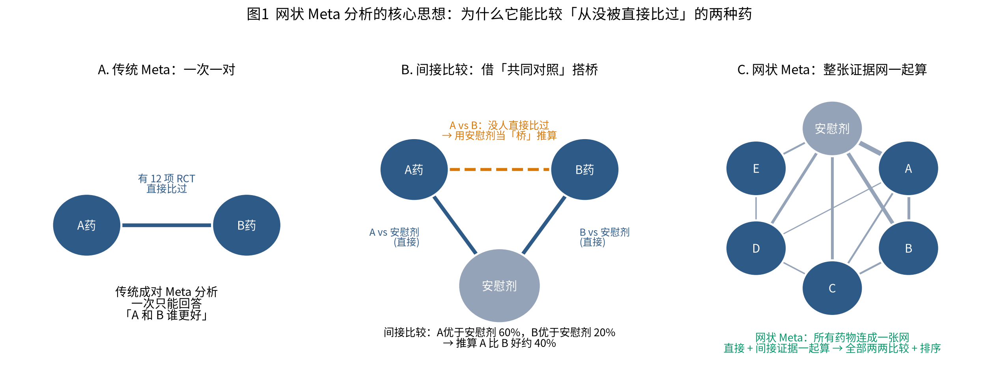
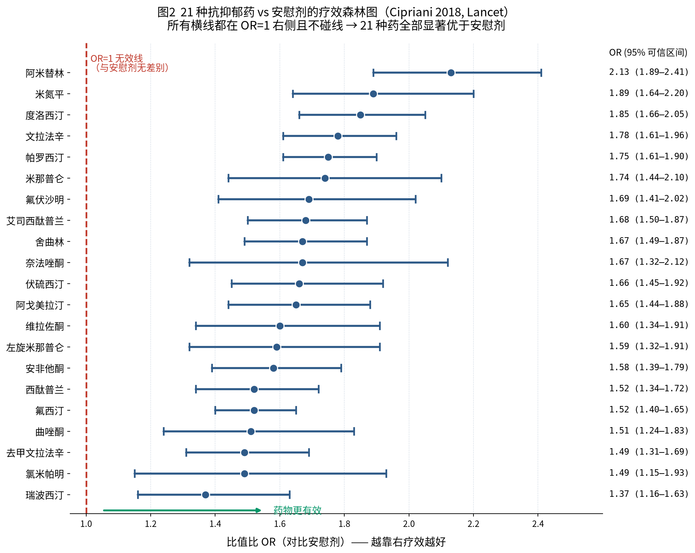
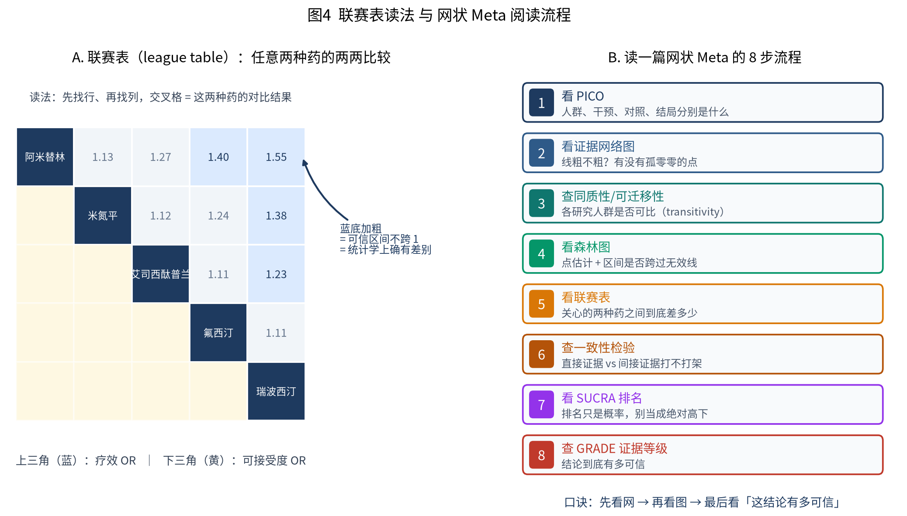
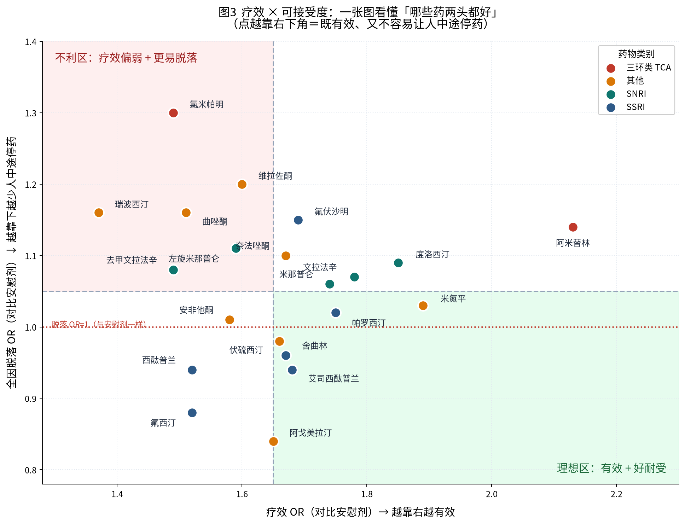

# 零基础精读一篇网状 Meta 分析

## —— 以 Cipriani 2018 *Lancet* 21 种抗抑郁药研究为例

> **本文定位**：假设你完全没接触过 Meta 分析，我们从「什么是 Meta」讲到「怎么看懂这篇 Lancet」。
> 全文按照**真实读文献的顺序**展开，每讲一个概念立刻回到原文对照。
> 建议配合 4 张自制图一起看（`figures/` 目录）。

---

## 📖 目录

| 章节 | 内容 | 适合谁 |
|---|---|---|
| [第 0 章](#第-0-章-先认识这篇文献) | 这篇文献是什么来头 | 所有人 |
| [第 1 章](#第-1-章-三个层次从-rct-到-meta-到网状-meta) | 从 RCT → Meta → 网状 Meta | 零基础必读 |
| [第 2 章](#第-2-章-核心概念直接比较-vs-间接比较) | 网状 Meta 的核心魔法 | 零基础必读 |
| [第 3 章](#第-3-章-读懂标题和摘要40-秒抓住全文) | 摘要逐句拆解 | 所有人 |
| [第 4 章](#第-4-章-方法学部分它是怎么做出来的) | 方法学逐段精读 | 想自己做的人 |
| [第 5 章](#第-5-章-读懂那些统计名词) | OR / CrI / SUCRA / GRADE | 零基础必读 |
| [第 6 章](#第-6-章-看懂四张核心图) | 图 1-5 逐张读图 | 所有人 |
| [第 7 章](#第-7-章-三大假设网状-meta-的地基) | 同质性/可迁移性/一致性 | 进阶 |
| [第 8 章](#第-8-章-这篇文章的局限与争议) | 批判性阅读 | 进阶 |
| [第 9 章](#第-9-章-八步速查表以后读任何一篇-nma) | 可复用清单 | 所有人 |
| [附录](#附录-术语中英对照速查) | 术语对照表 | 所有人 |

---

# 第 0 章 先认识这篇文献

## 0.1 文献信息

| 项目 | 内容 |
|---|---|
| **标题** | Comparative efficacy and acceptability of 21 antidepressant drugs for the acute treatment of adults with major depressive disorder: a systematic review and network meta-analysis |
| **中译** | 21 种抗抑郁药治疗成人重度抑郁症急性期的疗效与可接受度比较：系统评价与网状 Meta 分析 |
| **作者** | Andrea Cipriani, Toshi A Furukawa, Georgia Salanti 等（牛津大学、京都大学、伯尔尼大学联合团队） |
| **期刊** | *The Lancet*（柳叶刀），2018;391(10128):1357-1366 |
| **DOI** | 10.1016/S0140-6736(17)32802-7 |
| **免费全文** | PMC5889788（PubMed Central 可免费下载） |
| **原始数据** | Mendeley Data, DOI:10.17632/83rthbp8ys.2（**全部公开**） |
| **注册号** | PROSPERO CRD42012002291 |

## 0.2 为什么拿这篇当教材

1. **规模空前**：522 项双盲 RCT、116 477 名患者，是抗抑郁药领域史上最大的 Meta 分析。
2. **方法学标杆**：作者里的 Georgia Salanti、Anna Chaimani、Julian Higgins 就是**写网状 Meta 方法学教科书的人**（Cochrane Handbook 的作者）。这篇文章的每个方法学环节都是"标准答案"。
3. **数据全公开**：原始数据放在 Mendeley，任何人可下载复现。
4. **争议充分**：发表后 BMJ Open、Lancet 通讯栏都有批评文章。**读完正方再读反方，才算真读懂。**
5. **临床影响巨大**：直接影响了多国抑郁症诊疗指南。

## 0.3 团队作者的信号

> 💡 **零基础小技巧**：看到作者列表里有 **Salanti / Chaimani / Higgins / Egger** 这些名字，
> 你基本可以放心——这几位是循证医学方法学的顶级权威。
> 相反，如果一篇 NMA 的作者全是临床医生、没有统计学家，方法学细节就要多留个心眼。

---

# 第 1 章 三个层次：从 RCT 到 Meta 到网状 Meta

这是理解全文的地基。我们用一个生活化的例子。

## 1.1 第一层：单个 RCT（随机对照试验）

**场景**：一家医院做了个试验，200 个抑郁症患者随机分两组，一组吃 A 药，一组吃安慰剂，8 周后看谁好转的多。

- ✅ **优点**：随机分组，两组基线可比，因果推断最强。
- ❌ **缺点**：只有 200 人，样本小、可能是运气；而且**只能回答 A 药 vs 安慰剂**。

## 1.2 第二层：传统 Meta 分析（成对 Meta）

**场景**：全世界一共有 12 项 RCT 都比较过 A 药 vs 安慰剂。把这 12 项**合并**起来算一个总的效果。

- ✅ **优点**：样本量从 200 变成 5000，结论稳得多。
- ❌ **致命局限**：**一次只能比一对**。

> **关键痛点**：临床医生真正想问的是「**A 药和 B 药，我该开哪个？**」
> 但如果全世界从来没有一项 RCT 直接把 A 和 B 放在一起比过，传统 Meta 就**彻底哑火**。

这在现实里极其常见——药厂做新药试验时，为了拿批文，**几乎都是跟安慰剂比**，很少花钱跟竞争对手的药比。

## 1.3 第三层：网状 Meta 分析（NMA）

**核心思想**：既然 A 和 B 都跟安慰剂比过，那就**用安慰剂当"桥梁"**，间接推算出 A 和 B 的差距。

📊 **请看 `figures/fig1_network_concept.png`（图1）**



- **面板 A**：传统 Meta，两个点一条线，只能回答一个问题。
- **面板 B**：间接比较。A 和 B 之间那条**橙色虚线**是"算"出来的，不是"测"出来的。
- **面板 C**：真实的网状 Meta，所有药物连成一张网，一次性算出**所有两两组合**。

> 🔑 **一句话记住 NMA**：
> **把散落各处的"局部战报"拼成一张"全局地图"，让从没交手过的两种药也能分出高下。**

## 1.4 网状 Meta 能多出什么本事

| 能力 | 传统 Meta | 网状 Meta |
|---|:---:|:---:|
| 合并同一对比较的多项研究 | ✅ | ✅ |
| 比较从未直接对比过的两种治疗 | ❌ | ✅ |
| 给所有治疗**排名** | ❌ | ✅ |
| 同时纳入直接 + 间接证据（提高精度） | ❌ | ✅ |
| 一张图看完整个领域的证据格局 | ❌ | ✅ |

**这篇文章的体现**：21 种药 + 安慰剂 = 22 个节点，理论上有 22×21÷2 = **231 种两两组合**。
现实中直接比过的只是其中一小部分，但 NMA 让作者把 231 组全部估计了出来。

---

# 第 2 章 核心概念：直接比较 vs 间接比较

## 2.1 用具体数字算一遍

假设：
- **A 药 vs 安慰剂**：A 药让好转的机会**提高 60%**
- **B 药 vs 安慰剂**：B 药让好转的机会**提高 20%**

那么间接推算：**A 药 vs B 药** ≈ 1.60 ÷ 1.20 = **1.33**，即 A 药比 B 药大约好 33%。

> ⚠️ **注意**：真实计算是在**对数尺度**上做加减（log(1.60) − log(1.20)），
> 因为 OR 这类比值指标取对数后才近似正态分布。但直觉上你就理解成"相除"即可。

## 2.2 三种证据的关系

| 证据类型 | 来源 | 特点 |
|---|---|---|
| **直接证据** (direct) | 真的有 RCT 把 A 和 B 放一起比过 | 最可靠，但常常没有 |
| **间接证据** (indirect) | 通过共同对照推算 | 补足空白，但依赖假设 |
| **混合证据** (mixed / network) | 直接 + 间接**加权合并** | NMA 的最终输出，精度最高 |

**这篇文章的实例**：
- 21 种药里，**只有左旋米那普仑（levomilnacipran）没有跟任何一种活性药直接比过**——它的所有排名信息都来自间接证据。
- **米那普仑（milnacipran）是唯一没有安慰剂对照试验的药**。

> 🔍 **读图技巧**：在证据网络图（原文 Figure 2）里，
> 这种"只连着一两条线"的节点，它的结论就要打个折扣看。

---

# 第 3 章 读懂标题和摘要：40 秒抓住全文

## 3.1 拆解标题

> **Comparative efficacy and acceptability** | **of 21 antidepressant drugs** | **for the acute treatment** | **of adults with major depressive disorder** | **: a systematic review and network meta-analysis**

| 片段 | 含义 | 对应 PICO |
|---|---|---|
| Comparative **efficacy** and **acceptability** | 比较**疗效**和**可接受度** | **O** (Outcome) |
| of **21 antidepressant drugs** | 21 种抗抑郁药 | **I** (Intervention) |
| for the **acute** treatment | **急性期**治疗（约 8 周，不是长期维持） | 限定条件 |
| of **adults** with **major depressive disorder** | 成人重度抑郁症 | **P** (Population) |
| systematic review and **network meta-analysis** | 系统评价 + 网状 Meta | 研究类型 |

> 💡 **PICO 是什么**：读任何临床研究的第一步，就是抓出这 4 个要素：
> **P**opulation（什么人）、**I**ntervention（什么干预）、**C**omparison（跟什么比）、**O**utcome（看什么结局）。
> 这篇的 C（对照）藏在正文里：安慰剂 + 其他抗抑郁药。

**⚠️ 标题里最容易被忽略的词：`acute`（急性期）**
这篇文章**只回答"用药 8 周内"的效果**。它**不能**告诉你：吃一年怎么样、停药会不会复发、难治性抑郁怎么办。很多媒体报道就是在这里过度解读的。

## 3.2 摘要的标准结构（结构式摘要）

Lancet 的摘要是固定的 5 段式，每段回答一个问题：

| 段落 | 英文 | 回答什么 | 这篇的答案 |
|---|---|---|---|
| 1 | **Background** | 为什么做这研究 | 抗抑郁药到底有没有用，学界吵了十几年 |
| 2 | **Methods** | 怎么做的 | 检索 10 个数据库 + 未发表数据，纳入双盲 RCT，贝叶斯随机效应 NMA |
| 3 | **Findings** | 发现了什么 | 522 项试验、116 477 人；**21 种药全部优于安慰剂** |
| 4 | **Interpretation** | 意味着什么 | 应指导循证实践和临床决策 |
| 5 | **Funding** | 谁出的钱 | NIHR 牛津健康生物医学研究中心 + 日本学术振兴会 |

## 3.3 摘要核心句逐句翻译

> **原文**："In terms of efficacy, all antidepressants were more effective than placebo, with ORs ranging between 2·13 (95% credible interval [CrI] 1·89–2·41) for amitriptyline and 1·37 (1·16–1·63) for reboxetine."

**逐词翻译**：
- `In terms of efficacy` = 在疗效方面
- `all antidepressants were more effective than placebo` = **所有 21 种药都比安慰剂有效**
- `ORs ranging between 2.13 ... and 1.37` = 比值比从最高 2.13 到最低 1.37
- `amitriptyline` = 阿米替林（最有效），`reboxetine` = 瑞波西汀（最弱）
- `95% credible interval [CrI]` = 95% **可信区间**（贝叶斯方法的产物，见第 5 章）

**人话版**：吃阿米替林好转的机会是吃安慰剂的 2.13 倍，吃瑞波西汀是 1.37 倍，**其他 19 种药都在这两个数之间**。

> **原文**："For acceptability, only agomelatine (OR 0·84, 95% CrI 0·72–0·97) and fluoxetine (0·88, 0·80–0·96) were associated with fewer dropouts than placebo, whereas clomipramine was worse than placebo (1·30, 1·01–1·68)."

**人话版**：论"病人愿不愿意坚持吃"，**只有阿戈美拉汀和氟西汀比安慰剂还好**（脱落率更低），
**氯米帕明比安慰剂还差**（更多人中途退出），剩下 18 种药跟安慰剂没有统计学差别。

> 🤔 **等一下，为什么会有药"比安慰剂更少人退出"？**
> 因为脱落有两个原因：①**副作用大**受不了 → 退出；②**没效果**，病人失望 → 退出。
> 安慰剂组虽然副作用小，但因为没效果，退出的人也不少。所以疗效好的药可以"抵消"副作用带来的脱落。
> 这就是为什么作者用**全因脱落**（all-cause discontinuation）来衡量"可接受度"——它**同时装进了疗效和耐受性**。

---

# 第 4 章 方法学部分：它是怎么做出来的

这一章讲的是原文 Methods 部分。**零基础读者第一遍可以快速略过，但这里是判断一篇 NMA 好坏的关键。**

## 4.1 检索策略（Search strategy）

作者检索了 **10 个数据库**：Cochrane CENTRAL、CINAHL、Embase、LILACS、MEDLINE、MEDLINE In-Process、PsycINFO、AMED、UK National Research Register、PSYNDEX。

**时间范围**：建库起 → 2016 年 1 月 8 日。**无语言限制**（不只收英文文献）。

### 🌟 这篇文章最了不起的一点：挖未发表数据

作者不只搜数据库，还：
- 搜 **ClinicalTrials.gov** 等临床试验注册库
- 搜**药品监管机构网站**（FDA、EMA 等）
- **直接联系所有生产抗抑郁药的药厂**，索要未发表的研究数据
- 联系原研究作者补数据

**结果**：522 项试验里，**274 项（52%）拿到了未发表信息**；其中 86 项试验完全来自试验注册库和药厂网站。

> 🔑 **为什么这很重要**：药厂有强烈动机**只发表结果好看的试验**（这叫**发表偏倚 publication bias**）。
> 如果只搜已发表文献，Meta 分析会**系统性高估**药物疗效。
> 挖出未发表数据，是这篇文章方法学质量的最大亮点。

## 4.2 纳入与排除标准

**纳入**：
- 双盲随机对照试验（**只要双盲**，因为纳入了安慰剂，且双盲能减少测量偏倚）
- 成人（≥18 岁），按标准诊断标准（DSM-III/IV/5、ICD-10 等）诊断的重度抑郁症
- 口服单药治疗（monotherapy）
- 剂量在**说明书批准范围内**

**排除**：
- 准随机试验（quasi-randomised，比如按住院号单双数分组）
- 含 ≥20% 双相障碍、精神病性抑郁、难治性抑郁患者的试验
- 合并严重躯体疾病的患者

> 💡 **这些排除标准的意义**：它们是在**保护"可迁移性"假设**（见第 7 章）。
> 如果 A 药的试验做的是轻症门诊患者，B 药的试验做的是重症住院患者，
> 那"用安慰剂搭桥"推出的 A vs B 就不可信了。

## 4.3 结局指标（Outcomes）

| 类型 | 指标 | 定义 |
|---|---|---|
| **主要结局 1** | **疗效 efficacy** | **有效率**：抑郁量表总分下降 ≥50% 的患者比例 |
| **主要结局 2** | **可接受度 acceptability** | **全因脱落率**：任何原因中途退出的患者比例 |
| 次要结局 | 终点抑郁评分 | 治疗结束时的量表得分（连续变量） |
| 次要结局 | 缓解率 remission | 量表得分低于某阈值（比"有效"更严格） |
| 次要结局 | 因不良反应脱落 | 专门因副作用退出的比例 |

**时间点**：尽量取**第 8 周**的数据；拿不到就用 4–12 周中最接近 8 周的。

## 4.4 统计方法（关键段落）

原文这几句话信息量极大，我们逐句拆：

> "We estimated summary **odds ratios (ORs)** for dichotomous outcomes and **standardised mean differences (SMD, Cohen's d)** for continuous outcomes"

- **二分类结局**（有效/无效）→ 用 **OR**（比值比）
- **连续型结局**（量表得分）→ 用 **SMD**（标准化均数差）

> "The study effect sizes were then synthesised using a **random-effects** network meta-analysis model."

- **随机效应模型**：假设各研究的真实效应**不完全一样**，允许存在差异。
- 对应的是**固定效应模型**（假设所有研究测的是同一个真值）。
- 👉 **现实中绝大多数 Meta 都该用随机效应**，因为各研究的人群、剂量、疗程总有差别。

> "We fitted all models in **OpenBUGS** ... using the binomial likelihood ... **uninformative prior distributions**"

- **OpenBUGS** = 做**贝叶斯统计**的软件。
- **无信息先验**（uninformative prior）= "我事先不预设任何立场，让数据自己说话"。
- 👉 这就是为什么结果报的是 **CrI（可信区间）** 而不是 **CI（置信区间）**——见第 5 章。

> "To rank the treatments for each outcome, we used the **surface under the cumulative ranking curve (SUCRA)**"

- **SUCRA** = 累积排序曲线下面积，用来给治疗排名。见第 5 章。

**验证工作**：作者还用 R 的 `netmeta` 包**重跑了一遍**主要结局，Stata 的 `network` 包画网络图。
> 💡 **两种软件互相验证**，是方法学严谨的表现。

---

# 第 5 章 读懂那些统计名词

这一章是**零基础读者的核心章节**。每个概念我都给"教科书定义 + 人话解释 + 本文实例"。

## 5.1 OR（Odds Ratio，比值比）

### 教科书定义
两组"事件发生比值"的比值。

### 人话解释
先理解 **odds（比值）**：如果 100 个人吃药，60 个好转、40 个没好转，那 odds = 60/40 = **1.5**。
（注意：这跟"概率 60%"不一样，odds 是**好转数 ÷ 没好转数**）

**OR = 治疗组的 odds ÷ 对照组的 odds**

### 怎么解读

| OR 值 | 含义 |
|---|---|
| **OR = 1** | 两组**完全没差别**（这就是"无效线") |
| **OR > 1** | 治疗组事件更容易发生 |
| **OR < 1** | 治疗组事件更不容易发生 |

⚠️ **关键**：OR 是好是坏，**取决于"事件"是好事还是坏事**！

| 本文实例 | 事件是什么 | OR=2.13 意味着 |
|---|---|---|
| **疗效**：阿米替林 OR=2.13 | "好转"（好事） | 好转的 odds 是安慰剂组的 2.13 倍 → **药更好** ✅ |
| **可接受度**：氯米帕明 OR=1.30 | "中途退出"（坏事） | 退出的 odds 是安慰剂的 1.30 倍 → **药更差** ❌ |

> 🔑 **所以读森林图时，第一件事永远是：看清楚"事件"是什么，以及"往哪边是好"。**
> 原文 Figure 3 的两个面板，箭头方向是**相反**的！

### 常见误区

> ❌ **错误理解**："OR = 2.13 意味着吃药好转的**人数**是安慰剂的 2.13 倍。"
> ✅ **正确理解**：是**比值（odds）**的 2.13 倍，不是人数或概率的 2.13 倍。
> 当结局事件比较常见时（比如有效率 50%），OR 会**放大**真实差距。

## 5.2 CrI vs CI：可信区间 vs 置信区间

这是本文一个非常重要的细节，很多人会读漏。

| | **CI**（Confidence Interval，置信区间） | **CrI**（Credible Interval，可信区间） |
|---|---|---|
| **属于** | 频率学派（传统统计） | **贝叶斯学派** |
| **怎么念** | 95% 置信区间 | 95% 可信区间 |
| **严格含义** | "重复做 100 次这个研究，有 95 次算出的区间会盖住真值" | "**真值有 95% 的概率落在这个区间内**" |
| **本文用哪个** | ❌ | ✅ **本文用 CrI** |

> 💡 **为什么 CrI 更好理解**：CrI 的解释就是你直觉里想的那个意思——"真值有 95% 可能在这里面"。
> 而 CI 的严格定义其实**反直觉**（真值是固定的，随机的是区间）。
> 因为这篇用了贝叶斯方法（OpenBUGS + 无信息先验），所以报的是 CrI。

### 怎么用区间判断"有没有统计学差异"

**看区间有没有跨过"无效线"**（对 OR 来说无效线 = 1）：

| 例子 | 区间 | 跨过 1 吗 | 结论 |
|---|---|---|---|
| 阿米替林疗效 | 1.89 – 2.41 | ❌ 全在 1 右边 | **有统计学意义**，确实比安慰剂好 |
| 瑞波西汀疗效 | 1.16 – 1.63 | ❌ 全在 1 右边 | **有统计学意义**（虽然效果最弱） |
| 阿戈美拉汀脱落 | 0.72 – 0.97 | ❌ 全在 1 左边 | **有统计学意义**，脱落确实更少 |
| 阿戈美拉汀因副作用脱落 | 0.94 – 1.56 | ✅ **跨过 1** | **无统计学意义**，说不清 |

> 🔑 **区间宽度 = 结论的确定性**。
> 区间**窄** → 数据多、结论稳；区间**宽** → 数据少、别太当真。
> 本文里奈法唑酮（1.32–2.12）的区间就比氟西汀（1.40–1.65）宽得多，因为前者研究少。

## 5.3 SMD（标准化均数差）

**用于连续变量**（比如抑郁量表得分）。因为不同研究用的量表不一样（HAMD 17 项 vs MADRS），得分不能直接比，所以要"标准化"。

**本文结果**：所有抗抑郁药合起来的 **SMD = 0.30（95% CrI 0.26–0.34）**

| SMD | 惯例解读（Cohen） |
|---|---|
| 0.2 | 小效应 |
| **0.3** | **本文的结果——小到中等** |
| 0.5 | 中等效应 |
| 0.8 | 大效应 |

> ⚠️ **这个 0.30 是全文最有争议的数字**。批评者认为 0.30 换算到 HAMD 量表上只有约 2 分，
> 而临床上一般认为要 **3 分以上**才算患者能感受到的改善。见第 8 章。

## 5.4 SUCRA（累积排序曲线下面积）

### 人话解释
一个 **0% ~ 100%** 的分数，回答：**"这个治疗排到前面的可能性有多大？"**

- **SUCRA = 100%** → 它**肯定**是最好的
- **SUCRA = 50%** → 中不溜
- **SUCRA = 0%** → 它**肯定**是最差的

### ⚠️ SUCRA 的三大陷阱（非常重要）

1. **排名 ≠ 有显著差异**。第 1 名和第 5 名的可信区间可能大面积重叠，"排名"只是把点估计排了个序。
2. **SUCRA 对数据量不敏感**。一个只有 2 项小研究的药，可能因为点估计碰巧很高而排到第一，但它的证据其实很弱。
3. **排名会随纳入研究变化而剧烈波动**。有研究专门量化过 SUCRA 排名的不稳定性。

> 🔑 **正确用法**：SUCRA 用来**筛掉明显差的**，而不是用来**钦点第一名**。
> 本文作者自己也很谨慎——他们把 SUCRA 排名放在**附录**（appendix pp 266–85），
> 正文强调的是**效应量和证据质量**，而不是排行榜。

## 5.5 异质性（Heterogeneity）

**含义**：各项研究之间的结果**差异有多大**。

**本文结果**：
- 有效率的异质性方差中位数 = **0.044（95% CrI 0.028–0.063）**
- 脱落率的异质性方差中位数 = **0.040（0.023–0.062）**
- 作者判断：**中到低度异质性**（moderate-to-low）

**有意思的发现**：作者做 meta 回归发现，**"是否用了安慰剂对照"是异质性的最大来源**。
排除安慰剂对照试验后，有效率的异质性方差**下降 24%**，脱落率**下降 45%**。

## 5.6 GRADE（证据质量分级）

**四个等级**：高（High）→ 中（Moderate）→ 低（Low）→ 极低（Very low）

**本文的 GRADE 结果**（这是全文最该被记住、也最常被忽略的一句）：

> "the certainty of evidence was **moderate to very low**"
> 证据确定性为**中等到极低**

具体来说：
- **中等质量**：涉及阿戈美拉汀、艾司西酞普兰、西酞普兰、米氮平的多数比较
- **低到极低质量**：涉及伏硫西汀、奈法唑酮、氯米帕明、安非他酮、阿米替林的多数比较

> 🔑 **注意这个反差**：阿米替林在疗效排名上是**第 1 名**（OR 2.13），
> 但它的**证据质量是"低到极低"**！
> 因为它的试验大多是 1980 年代的小样本老研究，偏倚风险高。
> **这就是为什么不能只看排行榜。**

## 5.7 偏倚风险（Risk of bias）

本文用 Cochrane 偏倚风险工具评估 522 项试验：

| 等级 | 数量 | 占比 |
|---|---|---|
| 高风险 High | 46 | 9% |
| **中等风险 Moderate** | **380** | **73%** |
| 低风险 Low | 96 | 18% |

另外：**409 项（78%）试验由药厂资助**。

---

# 第 6 章 看懂四张核心图

## 6.1 原文 Figure 1：研究筛选流程图（PRISMA 流程图）

**长什么样**：一个从上往下的漏斗形流程图。

**怎么读**（从上到下）：
```
检索得到 28 552 篇文献
        ↓ 筛标题摘要，排除明显不相关的
全文评估 680 篇
        ↓ 按纳入排除标准筛
最终纳入 522 项 RCT（116 477 名患者）
        ├── 421 项来自数据库检索
        ├──  86 项来自试验注册库/药厂网站（未发表）
        └──  15 项来自个人联系/手工检索
```

> 💡 **看流程图重点关注**：从 28 552 掉到 522，**淘汰率 98%**。这很正常。
> 要留意的是**每一步排除了多少、为什么排除**——如果作者说不清，就是隐患。

## 6.2 原文 Figure 2：证据网络图 ⭐ NMA 独有

**长什么样**：一堆圆圈（节点）用线连起来，像蜘蛛网。

**怎么读**：

| 图形元素 | 代表什么 |
|---|---|
| **圆圈（节点）** | 一种治疗（药物或安慰剂） |
| **圆圈大小** | 该治疗的**随机化患者总数**（越大，人越多） |
| **线（连边）** | 这两种治疗**有直接比较的 RCT** |
| **线的粗细** | 直接比较的**试验数量**（越粗，研究越多） |
| **没有线** | 这两种治疗**从没被直接比过**（靠间接推算） |

**本文 Figure 2 的关键观察**：
1. **安慰剂是最大的中心节点**——因为绝大多数试验都是药 vs 安慰剂。
2. **除米那普仑外，所有药都有安慰剂对照试验**。
3. **只有左旋米那普仑没跟任何活性药直接比过**——它是网络的"边缘节点"。

> 🔑 **读网络图的黄金三问**：
> 1. **网络连通吗**？（有没有孤岛？孤岛无法比较）
> 2. **有没有"细腿"节点**？（只连 1-2 条细线的药，结论要打折）
> 3. **形状是"星形"还是"网状"**？
>    - **星形**（所有药只连安慰剂）→ 几乎全靠间接证据，可信度低
>    - **网状**（药与药之间也有连线）→ 有直接证据支撑，可信度高
>
> 本文属于**较好的网状结构**，但仍以安慰剂为中心。

## 6.3 原文 Figure 3：森林图（Forest Plot）⭐ 最核心

📊 **我按原文数据重绘了一张中文版：`figures/fig2_forest.png`**



### 森林图的解剖

| 元素 | 含义 |
|---|---|
| **纵轴** | 每一行 = 一种药 |
| **横轴** | 效应量（这里是 OR） |
| **红色虚线（OR=1）** | **无效线**——落在这里表示"和对照没差别" |
| **实心圆点** | **点估计**（最可能的真实值） |
| **横线（须）** | **95% 可信区间**（真值可能的范围） |
| **横线长度** | 越短 = 越精确 = 数据越充分 |

### 三步读森林图

**第 1 步：看方向。** 确认"往右是好还是坏"。本文 Figure 3A（疗效）往右 = 更有效。

**第 2 步：看有没有跨过无效线。**
- 横线**完全在无效线一侧** → **有统计学意义**
- 横线**碰到或跨过无效线** → **没有统计学意义**（说不清）

**第 3 步：看点估计的大小。**
统计学有意义 ≠ 临床上重要。OR=1.05 就算显著，临床意义也很小。

### 本文 Figure 3 的结论

- **面板 A（疗效）**：21 条横线**全部**落在 OR=1 的右侧且不碰线 → **21 种药全部显著优于安慰剂**。这是本文最重磅的结论。
- **面板 B（可接受度）**：大部分横线**跨过** OR=1 → 大多数药在"脱落率"上跟安慰剂**没差别**。只有阿戈美拉汀、氟西汀显著更好，氯米帕明显著更差。

## 6.4 原文 Figure 4：联赛表（League Table）⭐ NMA 独有

📊 **看我画的示意图：`figures/fig4_league_and_steps.png` 左半部分**



**长什么样**：一个**三角形矩阵**，对角线上是药名。

**怎么读**：
1. 对角线格子里是**药物名称**
2. **上三角**（右上半）= 疗效的两两比较 OR
3. **下三角**（左下半）= 可接受度的两两比较 OR
4. 想查"A 药 vs B 药"，就找 A 所在行 与 B 所在列 的交叉格

**本文 Figure 4 的特殊之处**：
- 药物按**字母顺序**排列
- **疗效**：OR > 1 favour **列**方向的药（即字母序更靠前的那个）
- **可接受度**：OR < 1 favour 字母序靠前的药
- **加粗+下划线** = 有统计学意义
- 作者还把 **GRADE 评级**用符号标进了表里（\* 中等质量、† 低质量、‡ 极低质量）

> ⚠️ **联赛表是 NMA 里最容易读错的图**。
> 一定要先看图注里的这句话："ORs higher than 1 favour the column-defining treatment"
> —— **搞清楚 OR>1 到底是利好行还是利好列**，方向搞反结论就完全颠倒了。

## 6.5 原文 Figure 5：疗效-可接受度二维图

📊 **我重绘了中文版：`figures/fig3_two_dim.png`**



**怎么读**：
- **横轴** = 疗效（越右越有效）
- **纵轴** = 脱落率（我这张图里越**下**越少人退出 = 越好）
- **右下角 = 理想药物**：既有效，又不容易让人中途停药
- **左上角 = 最不利**：疗效弱还容易脱落

> 💡 原文 Figure 5 是以**瑞波西汀为参照**画的，我这张改用**安慰剂为参照**，更直观。

**从图中能直接看出的结论**（与原文讨论一致）：
- **艾司西酞普兰、舍曲林、阿戈美拉汀、氟西汀**在"平衡"上表现好（偏右下）
- **阿米替林**疗效最强，但脱落率偏高（右上）——**有效但难耐受**
- **氯米帕明、瑞波西汀、曲唑酮**位置最差（偏左上）

---

# 第 7 章 三大假设：网状 Meta 的地基

**这是网状 Meta 与传统 Meta 最本质的区别**——它多了几条必须成立的假设。假设塌了，结论就塌了。

## 7.1 假设一：同质性（Homogeneity）

**含义**：**同一个**比较里的多项研究，结果应该足够接近。

**类比**：你测同一个人的身高 10 次，结果应该差不多。如果一次 170cm 一次 190cm，那测量方法肯定有问题。

**本文怎么做的**：报告异质性方差（0.044 / 0.040），判定为中到低度异质性。

## 7.2 假设二：可迁移性 / 传递性（Transitivity）⭐ 最关键

**含义**：用来"搭桥"的共同对照，在不同比较里必须是**可比的**。

**类比**（最重要的直觉）：
> 你想比较小明和小红谁跑得快，但他们没同场竞技过。
> - 小明跟小刚比过：小明快 5 秒
> - 小红跟小刚比过：小红快 3 秒
> - 推论：小明比小红快 2 秒
>
> **但如果**——小明跟小刚比的时候小刚 20 岁巅峰期，小红跟小刚比的时候小刚已经 50 岁了？
> 那这个"桥"就是**歪的**，推论完全不成立。

**放到医学里**：如果 A 药的试验招的是**轻症年轻患者**，B 药的试验招的是**重症老年患者**，
那安慰剂组在两批试验里的表现根本不一样，"用安慰剂搭桥"就不成立。

**本文怎么保护这条假设**：
1. **严格的纳入标准**：都是成人、都是重度抑郁症、都是急性期、都是双盲、都是口服单药、剂量都在批准范围内
2. **明确排除**双相、精神病性抑郁、难治性抑郁、严重躯体病患者
3. **正式检验**：比较各比较组之间潜在效应修饰因素的分布
4. 通过 **meta 回归**检查研究年份、赞助来源、基线严重度、给药方案、研究精度、新颖性效应等协变量

> 🔑 **可迁移性是 NMA 最难验证的假设**——它**没有一个统计检验能直接证明它成立**，
> 只能靠**临床和方法学判断**。这是读任何 NMA 都要自己动脑判断的地方。

## 7.3 假设三：一致性（Consistency）

**含义**：**直接证据**和**间接证据**得出的结论应该**吻合**。

如果直接比较说 A 比 B 好，间接推算却说 B 比 A 好，那就是**不一致（inconsistency）**，说明网络内部有矛盾。

**本文怎么检验**：
- **design-by-treatment 检验**（整体一致性检验）
- **节点劈裂法**（node-splitting，把直接证据和间接证据分开算再比对）

**本文结果**：
| 结局 | 不一致的闭合环 | 检验 p 值 |
|---|---|---|
| 有效率 | 17/219（8%） | p = 0.063 |
| 脱落率 | 16/210（8%） | p = 0.219 |

> 💡 **怎么解读**：8% 的环不一致，p 值都 > 0.05，说明**没有发现严重的不一致**。
> 但注意有效率的 p=0.063 已经很接近 0.05 了，属于**临界状态**，值得留意。

> ⚠️ **注意"闭合环 (loop)"这个概念**：只有 A-B-C 形成三角（都互相比过）才能检验一致性。
> **如果网络是纯星形（所有药只跟安慰剂比），根本没有闭合环，一致性就无法检验。**

---

# 第 8 章 这篇文章的局限与争议

**读文献最重要的能力不是相信，而是判断。** 这一章讲这篇文章的软肋——包括作者自己承认的和外界批评的。

## 8.1 作者自己承认的局限

1. **只看急性期（8 周）**——不能回答长期疗效和复发预防。
2. **不能外推到特殊人群**——难治性抑郁、精神病性抑郁、合并严重躯体病的患者被排除了。
3. **群体水平数据**——用的是各组汇总数据，不是个体患者数据，无法预测"某个具体病人"该用哪种药。
4. **药厂资助占比高**——78% 的试验由药厂资助。
5. **证据质量整体不高**——GRADE 中等到极低。

## 8.2 作者发现的两个有趣偏倚

### 小样本效应（small-study effect）
作者发现**更小、更老的研究报告的疗效更大**，尤其是阿米替林、安非他酮、氟西汀、瑞波西汀。
> 这通常是发表偏倚的信号——小的阴性研究没被发表出来。

### 新颖性效应（novelty effect）⭐ 很少见的精彩分析
> "when a treatment was the **novel or experimental** drug of comparison, it appeared to be significantly more effective than when that same treatment was the **older or control** drug of comparison (difference **1.18-times**, 95% CrI 1.09–1.27)"

**人话**：**同一种药**，当它作为"新药"被研究时，看起来比它作为"老对照药"时**有效 18%**。

**为什么？** 因为药厂做新药试验时，会精心设计得对自家新药有利（选人群、选剂量、选终点）。
**作者校正这个效应后，各药之间的差距进一步缩小了。**

> 💡 这是本文方法学上最漂亮的一笔——**主动去找自己结论的破绽**。

## 8.3 外界的主要批评

发表后 *BMJ Open*、*The Lancet* 通讯栏都有批评文章：

**批评 1：效应量太小，临床意义存疑**
- SMD = 0.30 对应 HAMD 量表约 2 分，低于公认的最小临床重要差异（约 3 分）
- 批评者认为这个差距病人根本感觉不到

**批评 2：用"有效率"（response rate）作主要结局有问题**
- 有效率是把连续的量表得分**人为切成"有效/无效"两类**（≥50% 改善）
- 这种二分法会**放大**组间的微小差异

**批评 3：可复现性问题**
- 有批评指出，虽然作者共享了数据，但报告不够透明——比如没报告每个比较里具体纳入了多少研究、多少组、多少人

**批评 4：排名的可靠性**
- "在我们对证据只有很低信心的情况下给抗抑郁药排名，是有误导性的"

## 8.4 怎么看待这些争议

> 🔑 **一个成熟读者的立场**：
> 1. **"所有药都优于安慰剂"这个定性结论是稳的**——522 项试验、11 万人，方向不会错。
> 2. **"哪种药排第几"这个定量结论要打折扣**——效应量差距小、可信区间重叠、证据质量不高。
> 3. **"效果是否有临床意义"这是价值判断**——统计学显著 ≠ 病人感觉得到。
> 4. **本文最大的价值不是排行榜，而是**：它把这个领域所有能找到的证据（包括药厂藏着的）
>    整理成了一张公开、可复现的地图。

---

# 第 9 章 八步速查表：以后读任何一篇 NMA

📊 **速查图：`figures/fig4_league_and_steps.png` 右半部分**

| 步骤 | 看什么 | 关键问题 | 本文的答案 |
|:---:|---|---|---|
| **1** | **PICO** | 什么人、什么干预、跟什么比、看什么结局？ | 成人重度抑郁 / 21 种抗抑郁药 / 安慰剂+其他药 / 有效率+脱落率 |
| **2** | **证据网络图** | 网络连通吗？有没有"细腿"节点？星形还是网状？ | 连通，网状但以安慰剂为中心；左旋米那普仑是边缘节点 |
| **3** | **可迁移性** | 各研究的人群、剂量、疗程可比吗？ | 纳入标准严格，作者做了正式评估 ✅ |
| **4** | **森林图** | 往哪边是好？区间跨过无效线了吗？ | 21 种药疗效区间全在 OR=1 右侧 ✅ |
| **5** | **联赛表** | 我关心的两种药，差多少？显著吗？ | 药物间差异 OR 1.15–1.55，多数不显著 |
| **6** | **一致性检验** | 直接证据和间接证据打架吗？ | 8% 环不一致，p>0.05，无严重不一致 ✅ |
| **7** | **SUCRA 排名** | 排名靠谱吗？区间重叠吗？ | 作者刻意把排名放附录，正文不强调 ⚠️ |
| **8** | **GRADE 等级** | 这结论到底有多可信？ | **中等到极低** ⚠️⚠️ |

## 🚩 危险信号清单（看到这些要警惕）

- ❌ **纯星形网络**：所有干预只跟安慰剂比，没有任何直接头对头比较 → 全靠间接推算
- ❌ **网络不连通**：存在孤岛，却还给出了跨岛比较
- ❌ **只报排名不报效应量**：拿 SUCRA 当卖点，不给 OR 和区间
- ❌ **不报一致性检验**：或者报了但 p < 0.05 还硬说"结果稳健"
- ❌ **不做 GRADE**：不评估证据质量
- ❌ **纳入标准过宽**：人群差异极大却硬说满足可迁移性
- ❌ **作者里没有方法学家**：NMA 的统计门槛很高
- ❌ **未注册**：没有 PROSPERO 注册号或已发表的方案

---

# 附录：术语中英对照速查

| 英文 | 中文 | 一句话解释 |
|---|---|---|
| Network meta-analysis (NMA) | 网状 Meta 分析 | 把多种治疗连成网，同时比较所有组合 |
| Systematic review | 系统评价 | 用预设的、可复现的方法全面检索和总结文献 |
| Pairwise meta-analysis | 成对 Meta 分析 | 传统 Meta，一次只比一对 |
| Direct evidence | 直接证据 | 真有 RCT 把这两者比过 |
| Indirect evidence | 间接证据 | 通过共同对照推算出来的 |
| Mixed evidence | 混合证据 | 直接+间接加权合并 |
| Odds ratio (OR) | 比值比 | 两组"事件比值"的比值，=1 表示无差别 |
| Risk ratio (RR) | 风险比 | 两组发生率的比值 |
| Standardised mean difference (SMD) | 标准化均数差 | 不同量表的结果标准化后再比 |
| Credible interval (CrI) | 可信区间 | 贝叶斯的区间，"真值 95% 概率在此" |
| Confidence interval (CI) | 置信区间 | 频率学派的区间 |
| Heterogeneity | 异质性 | 各研究结果差异有多大 |
| Transitivity | 可迁移性/传递性 | 搭桥的共同对照必须可比 |
| Consistency / Coherence | 一致性 | 直接与间接证据是否吻合 |
| Inconsistency | 不一致 | 直接与间接证据打架 |
| Node-splitting | 节点劈裂法 | 把直接证据和间接证据分开算再比对 |
| Design-by-treatment test | 设计-治疗交互检验 | 一种整体一致性检验 |
| Loop | 闭合环 | 网络中形成三角/多边形的路径 |
| SUCRA | 累积排序曲线下面积 | 0-100% 的排名分数 |
| Rankogram | 排序概率图 | 展示每种治疗排第 1/2/3... 名的概率 |
| Forest plot | 森林图 | 展示效应量和区间的经典图 |
| League table | 联赛表 | 三角矩阵，展示所有两两比较 |
| Funnel plot | 漏斗图 | 检查发表偏倚 |
| Comparison-adjusted funnel plot | 比较校正漏斗图 | NMA 专用的漏斗图 |
| Publication bias | 发表偏倚 | 阳性结果更容易被发表 |
| Small-study effect | 小样本效应 | 小研究倾向报告更大的效应 |
| Risk of bias | 偏倚风险 | 研究本身设计和执行的质量 |
| GRADE | 证据质量分级 | 高/中/低/极低四级 |
| Random-effects model | 随机效应模型 | 允许各研究真实效应不同 |
| Fixed-effect model | 固定效应模型 | 假设所有研究测同一个真值 |
| Bayesian | 贝叶斯方法 | 用先验+数据得到后验分布 |
| Prior / Posterior | 先验/后验 | 分析前的信念 / 结合数据后的更新 |
| PICO | PICO 框架 | 人群/干预/对照/结局 |
| PRISMA-NMA | PRISMA 网状 Meta 扩展版 | NMA 的报告规范清单 |
| PROSPERO | 系统评价注册平台 | 事先注册研究方案防止事后改结局 |
| Response rate | 有效率 | 量表得分下降 ≥50% 的比例 |
| Remission rate | 缓解率 | 得分降到某阈值以下的比例 |
| All-cause discontinuation | 全因脱落 | 任何原因中途退出（本文的"可接受度"） |

---

## 📁 本目录文件说明

```
20260726_nma_tutorial_cipriani2018/
├── README.md                      ← 本文（主教程）
├── figures/
│   ├── fig1_network_concept.png   ← 图1：直接比较 vs 间接比较概念图
│   ├── fig2_forest.png            ← 图2：21 种药疗效森林图（中文重绘）
│   ├── fig3_two_dim.png           ← 图3：疗效×可接受度二维象限图
│   └── fig4_league_and_steps.png  ← 图4：联赛表读法 + 8 步流程
├── data/
│   └── efficacy_or.csv            ← 21 种药的 OR 数据
└── scripts/
    ├── _cjk.py                    ← 中文字体检测（遵循 skills/cjk-viz）
    ├── fig1_network_concept.py
    ├── fig2_forest.py
    ├── fig3_two_dim.py
    └── fig4_league_and_steps.py
```

## 📚 数据来源与免责声明

- **所有引用的数字**均来自 Cipriani et al., *Lancet* 2018;391:1357-1366 正文及其摘要
  （免费全文：PMC5889788）。
- **图 2 森林图**：首尾两药（阿米替林 2.13, 1.89–2.41；瑞波西汀 1.37, 1.16–1.63）
  为原文精确值；21 种药的**点估计**均取自原文 Figure 3；
  中间药物的**可信区间**为按原文区间宽度规律的**教学示意近似**，
  精确区间请查原文 Figure 3 与附录。
- **图 4 联赛表**为**读图方法示意**，数值为演示用，非原文真实数值。
- 本教程为**方法学教学材料**，**不构成任何临床用药建议**。
  抗抑郁药的选择必须由精神科医生根据个体情况决定。

---

*由 MedgeClaw 🧬🦀 生成 · 2026-07-26*
